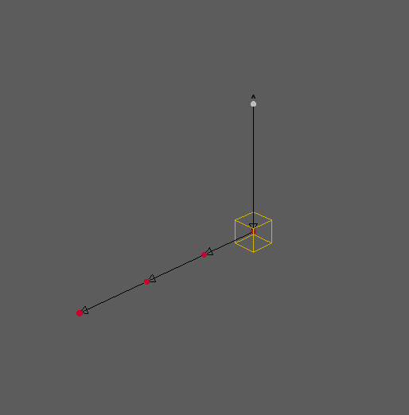
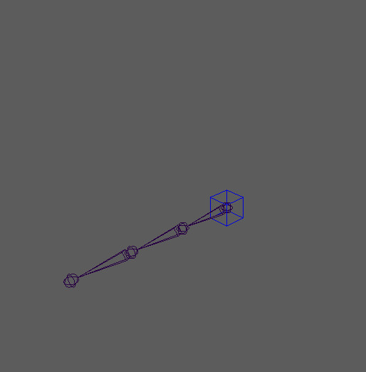

# Custom Limb Development

The MHY modular rigging system is developed using our action frame work Protostar,
Please refer to [Protostar's documentation](https://git.woa.com/MHY/protostar)
if you're not familiar with its concepts or usage.

Custom rig limbs are written as Python classes by extending the `BaseLimb` class
(which is a sub-class of Protostar's base `Action` class), it provides
the basic limb structure, default limb parameters, and useful features
such as marker system implementation, limb connection hooks, and many more
(See [API documentation]() for details).

## Getting Started

Let's start simple, imagine we need a simple FK limb with a single ctrl
that drives the rotation of a number of joints (number specified by the user).
Let's first block out our limb class:

``` python
import mhy.protostar.core.parameter as pa
from mhy.maya.rig.base_limb import BaseLimb


class CustomFKLimb(BaseLimb):
    """A limb action that makes a simple fk rig in maya.
    """

    # --- input parameters

    @pa.int_param(default=2, min_value=2, max_value=5)
    def num_joints(self):
        """The number of joints.
        This is an input parameter for recieving user input on the
        desired number of markers and joints."""

    # --- mandatory abstract method implementation

    def marker_data(self):
        """This is the marker system implementation.
        Must returns a dict containing marker data.
        """

    def run(self):
        """The core execution code.
        Build a ctrl rig onto the rig skeleton."""
```

In the above code, we defined an input parameter `num_joints` for
receiving user customization. (See Protostar's
[parameter documentation](https://git.woa.com/MHY/protostar/blob/master/doc/parameter_guide.md)
for details).

Before implementing method `run()` to build the control rig, we need to ensure
a proper rig skeleton is in place. To do so, we need to implement 2 methods,
one for enabling marker system and one for enabling pre-built skeleton support.

## Marker System Implementation

Maker system is an interface containing a series markers, allowing the user to
define articulation points by placing each marker at a desired location on a
character. With a maker system in place, a proper rig skeleton can be generated
before the control rig.

Marker system is created by implementing method `marker_data()` in the limb class.
This method must return a dict containing a proper marker system definition
(See [marker system's API documentation](../autoapi/mhy.maya.rig.marker_system.html)
for details on the data format).

For our example, the marker definition must be built from user input:

``` python
    def marker_data(self):
        """This is the marker system implementation.
        Must returns a dict containing marker data.
        """
        part = self.part.value
        side = self.side.enum_value
        data = {
            'aim_axis': 'x',
            'up_axis': 'z',
            'up_ctrl_position': (0, 10, 0),
            'markers': []}

        count = self.num_joints.value
        for i in range(count):
            name = NodeName(part=part, side=side, num=i, ext=const.EXT_MARKER)
            cns = 'parent' if i == count - 1 else 'aim'
            data['markers'].append({
                'name': name,
                'position': (0, 0, 5 * i),
                'rotation': cns,
                'up_type': 'ctrl',
            })

        return data
```

Note that we used the `part` parameter and the `side` parameter (built-in
parameters in all limbs) along side the `num_joints` parameter to create a proper
name for each marker. This naming convention will carry into the skeleton and the
control rig. We defined the rotation type for each non-leaf marker as `aim` (aiming
at the child), and the rotation type for the leaf marker as `parent` (inheriting
its parent rotation). We also defined a up type of `ctrl`, it'll generate a separate
up axis control for tweaking the axis orientation for markers with the `aim` rotation
type.

In the rig build script, the marker definition of each limb will be used by action
`ImprotMarkerSystem` to generate a complete marker system in the scene. Below is
a simple build script demonstrating the process:

``` python
from mhy.protostar.lib import ActionLibrary as alib
alib.refresh()

rig = alib.create_graph(name='rig_build')

# --- build the default marker system for each limb in the same graph,
# --- then applies a user marker data, if specified.

marker_import = alib.create_action(
    'mhy:ImportMarkerSystem', name='marker_system', graph=rig)
marker_import.data_file.value = 'path/to/user/data.json'

# --- execute rig build
rig.execute()
```

In the above build script example, `marker_import` action will generate 4 markers
according to our definition:

``` python
['fk_00_L_MARKER', 'fk_01_L_MARKER', 'fk_02_L_MARKER', 'fk_03_L_MARKER']
```

This is what it looks like in the scene (the additional white marker is the up axis
ctrl we defined):


**The benefit of marker system**: It allows easy rig skeleton building and ensures
the rig skeleton meets all limb requirements (The limb writer defines it).

Marker system is not a required feature, some projects might prefer building
the control rig from a pre-built skeleton. In this case it is up to the user to
build a proper rig skeleton that satisfies the limb's expectations.

**To opt-out of the marker system**: simply return `None` in the `marker_data()`
implementation:

``` python
    def marker_data(self):
        """Disables marker system support."""
        return None
```

## Pre-built Skeleton Support

`BaseLimb` comes with default support for pre-built skeleton. To enable it, users
only need to set parameter `input_skeleton` to specify the rig skeleton.
This parameter supports one of the following input types:

+ single joint:
  `limb.input_skeleton.value = 'a_single_joint'`
+ single chain:
  `limb.input_skeleton.value = ('start_joint', 'end_joint')`
+ multi-chain:
  `limb.input_skeleton.value = (('start_joint_a', 'end_joint_a'),
  ('start_joint_b', 'end_joint_b')... )`

For our custom FK limb, lets setup our limb class to require single chain
skeleton input:

``` python
class CustomFKLimb(BaseLimb):

    # set the input skeleton type to be single chain.
    _INPUT_SKEL_TYPE = const.InputSkelType.single_chain
```

Before the control rig is executed, the value of `input_skeleton` will be resolved
to a complete rig skeleton, which is accessible by `self.rig_skeleton`.
As you might've already noticed, `self.rig_skeleton` is the one and only accesser
to rig skeleton during control rig build, regardless if the limb supports maker system,
or pre-built skeleton, or both.

**If a limb supports both, It is the limb writer's responsibility to ensure the
rig skeleton built from the marker system and the rig skeleton resolved from
parameter `input_skeleton` are of the same format**, so that the control rig can
be built properly either way.

If we like to customize how the pre-built skeleton is resolved, say add additional
validation, we can re-implement `self.resolve_input_skeleton()`:

``` python
    def resolve_input_skeleton(self):
        """This is the method that resolves "input_skeleton" parameter,
        if not empty. (used by the user to pass in a pre-built skeleton).

        If "input_skeleton" is not empty, marker system will be skipped and
        the limb execution will directly use the joints provided by the user.
        """
        super(CustomFKLimb, self).resolve_input_skeleton()

        # add additional validation
        if self.skeleton[0][0].get_translation(space='world') != (0, 0, 0):
            raise exp.ActionError('The first rig joint must be at origin.')
```

## Control Rig Implementation

Once the rig skeleton is in place (either procedurally generated from marker system
or pre-built), it can be accessed by `self.rig_skeleton`.
This returns a list of a list, the 1st list level indicates each joint chain,
the 2nd level indicates each joint.

There's only one joint chain in our custom FK limb, so the result will be:

``` python
print(self.rig_skeleton)
# >> [['fk_00_L_RIGJNT', 'fk_01_L_RIGJNT', 'fk_02_L_RIGJNT', 'fk_03_L_RIGJNT']]
```

Now we can finally start implement the other required abstract method `run()` -
the main execution method that creates the control rig on top of the rig skeleton.
This is what we will do for our custom FK rig:

``` python
    def run(self):
        """The core execution code."""
        # get rig joints from the first chain (only chain)
        joints = self.rig_skeleton[0]

        # create the master ctrl
        name = NodeName(joints[0], num=None, ext='CTRL')
        ctrl = self.add_ctrl(
            name=name,
            parent=self.ctrl_root,
            shape='cube')
        ctrl.plc_node.align(joints[0])

        # constrain the root joint to the ctrl
        self.add_constraint('parent', ctrl, joints[0], maintainOffset=False)

        # propagate rotation values to each joint
        for joint in joints[1:]:
            joints[0].r >> joint.r

        # set the output parameter values
        self.output_ctrl.value = ctrl
```

Hopefully the above script is self-explanatory. Note that `BaseLimb` comes
with many handy helper methods. We used the following 2 in our example:

+ `self.add_ctrl()` Creates a controller and links it to the limb.
  **Always use this method to create controllers** to ensure proper control
  query in MHY animation tools.
+ `self.add_constraint()` Creates a Maya constraint and stores it in the limb.

See `BaseLimb`'s API documentation for all available helper methods.

Once execution, this is the control rig with rig skeleton underneath:


## Limb Connection Hooks

When a limb is connected to its parent limb, the default behavior is to constrain
the limb's plug nodes to the socket rig joint in the parent limb.

+ **plug node**: By default the limb root node is the plug node.
  We can add more by:

    ``` python
    self.add_plug(another_plug_node)
    ```

+ **socket rig joint**: This rig joint is determined either by the marker system
  connection, or the value of parameter `parent_joint` (when using pre-built skeleton).

The default connection behavior can also be customized via 2 hook methods:

``` python
    def connect_parent(self, parent_limb):
        """
        This method is called in the child limb when connecting to its parent.
        """
        super(CustomFKLimb, self).connect_parent(parent_limb)
        print('I am connecting to a {} limb!'.format(parent_limb.limb_type))

    def connect_child(self, child_limb):
        """
        This method is called in the parent limb when a child limb is connected.
        """
        super(CustomFKLimb, self).connect_child(child_limb)
        print('A {} limb connected to me!'.format(child_limb.limb_type))
```

## Summary

Ok, we've covered all topics about custom limb development, including:

+ limb class structure
+ marker system implementation vs pre-built rig skeleton support
+ limb connection hooks
+ control rig implementation

Now let's put everything together, here's our final custom FK limb class:

``` python
import mhy.protostar.core.parameter as pa
import mhy.protostar.core.exception as exp

from mhy.maya.standard.name import NodeName
from mhy.maya.rig.base_limb import BaseLimb
import mhy.maya.rig.constants as const


class CustomFKLimb(BaseLimb):
    """A limb action that makes a simple fk rig in maya.
    """

    # set the input skeleton type to be single chain.
    _INPUT_SKEL_TYPE = const.InputSkelType.single_chain

    # a link to the help page
    _HELP_URL = 'https://link/to/my/help/page'

    # --- input parameters

    @pa.int_param(default=2, min_value=2, max_value=5)
    def num_joints(self):
        """The number of joints.
        Also controls the number markers (if Marker System is used)."""

    # --- output parameters

    @pa.pyobject_param(output=True)
    def output_ctrl(self):
        """The fk ctrl object created by this limb."""

    # --- abstract method implementation

    def marker_data(self):
        """This is the marker system implementation.
        Must returns a dict containing marker data.
        """
        part = self.part.value
        side = self.side.enum_value
        data = {
            'aim_axis': 'x',
            'up_axis': 'z',
            'up_ctrl_position': (0, 10, 0),
            'markers': []}

        count = self.num_joints.value
        for i in range(count):
            name = NodeName(part=part, side=side, num=i, ext=const.EXT_MARKER)
            cns = 'parent' if i == count - 1 else 'aim'
            data['markers'].append({
                'name': name,
                'position': (0, 0, 5 * i),
                'rotation': cns,
                'up_type': 'ctrl',
            })

        return data

    def run(self):
        """The core execution code."""
        # get rig joints from the first chain (only chain)
        joints = self.rig_skeleton[0]

        # create the master ctrl
        name = NodeName(joints[0], num=None, ext='CTRL')
        ctrl = self.add_ctrl(
            name=name,
            parent=self.ctrl_root,
            shape='cube')
        ctrl.plc_node.align(joints[0])

        # constrain the root joint to the ctrl
        self.add_constraint('parent', ctrl, joints[0], maintainOffset=False)

        # propagate rotation values to each joint
        for joint in joints[1:]:
            joints[0].r >> joint.r

        # set the output parameter values
        self.output_ctrl.value = ctrl

    # --- Optional method implementation

    def resolve_input_skeleton(self):
        """This is the method that resolves "input_skeleton" parameter
        (used by the user to pass in a pre-built skeleton).

        If "input_skeleton" is not empty, marker system will be skipped and
        the limb execution will directly use the joints provided by the user.
        """
        super(CustomFKLimb, self).resolve_input_skeleton()

        # add additional validation
        if self.skeleton[0][0].get_translation(space='world') != (0, 0, 0):
            raise exp.ActionError('The first rig joint must be at origin.')

    def connect_parent(self, parent_limb):
        """
        This method is called in the child limb when connecting to its parent.
        """
        super(CustomFKLimb, self).connect_parent(parent_limb)
        print('I am connecting to a {} limb!'.format(parent_limb.limb_type))

    def connect_child(self, child_limb):
        """
        This method is called in the parent limb when a child limb is connected.
        """
        super(CustomFKLimb, self).connect_child(child_limb)
        print('A {} limb connected to me!'.format(child_limb.limb_type))
```

Here's the build script using our custom FK limb:

``` python
from mhy.protostar.lib import ActionLibrary as alib
alib.refresh()

USE_MARKER = True

rig = alib.create_graph(name='rig_build')


# --- build marker system, or import a pre-built rig skeleton

if USE_MARKER:
    marker_import = alib.create_action(
        'mhy:ImportMarkerSystem', name='marker_system', graph=rig)
    marker_import.data_file.value = 'path/to/user/data.json'
else:
    skel_import = alib.create_action(
        'mhy:ImportMarkerSystem', name='skel_import', graph=rig)
    skel_import.data_file.value = 'path/to/user/skeleton.ma'

# --- build a world offset limb

world_offset = alib.create_action(
    'mhy:WorldOffset', name='world_offset', graph=rig)
if not USE_MARKER:
    world_offset.input_skeleton.value = 'worldOffset_M_RIGJNT'

fk_limb = alib.create_action('CustomFKLimb', graph=rig, name='fk')
fk_limb.part.value = 'fk'
fk_limb.side.value = 'L'
fk_limb.num_joints.value = 4
fk_limb.set_parent_limb(world_offset)
if not USE_MARKER:
    fk_limb.input_skeleton.value = ('fk_00_L_RIGJNT', 'fk_03_L_RIGJNT')
    fk_limb.parent_joint.value = 'worldOffset_M_RIGJNT'

# --- execute rig build
rig.execute()
```

Happy limb writing! :)
