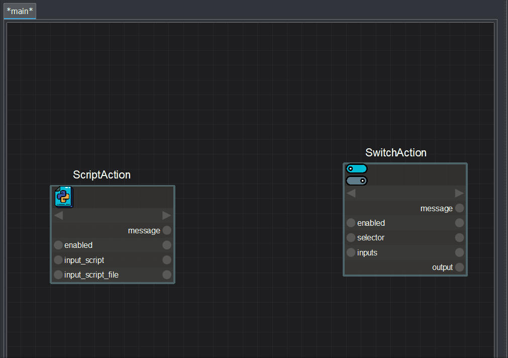
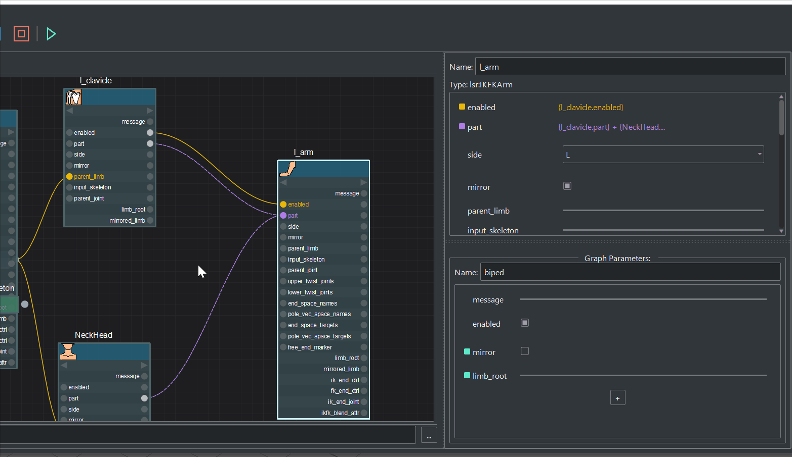
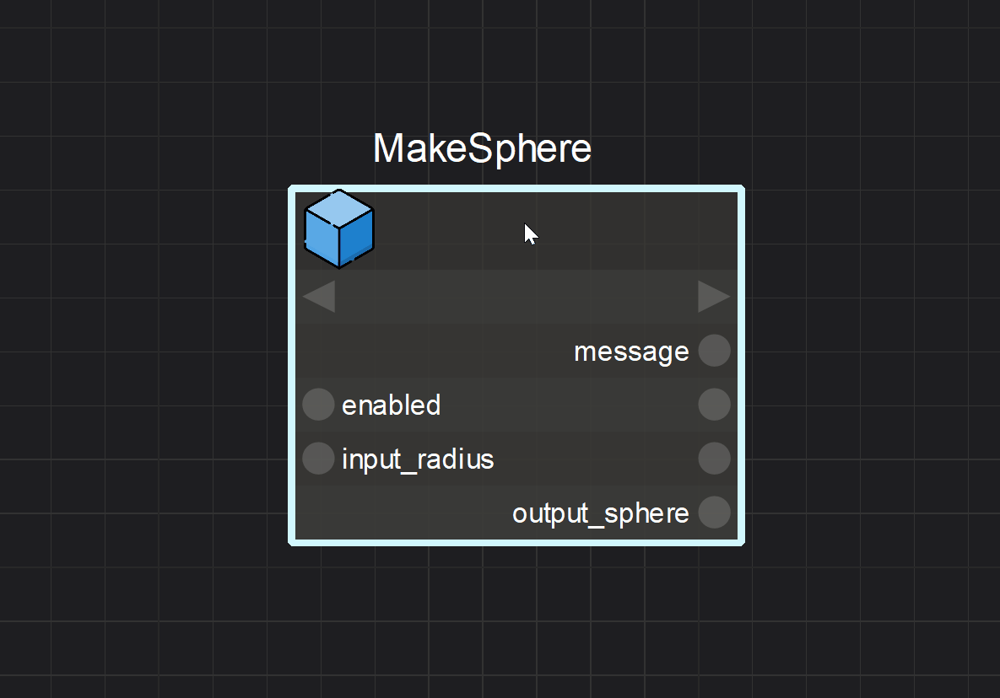

## Create Node
Right click on the graph view will prompt an action browser for searching and 
creating an action to the active view

Developer can register multiple tags to the action class. The tags will
be used as filter when creating action.

## Action vs Graph vs Parameter
There will be 3 types of nodes in the graph view:
1. **Action**: A regular node representing an action instance.
2. **Graph**: A node representing an action graph. Double click will prompt 
a new tag
for details in the graph
3. **Parameter**: Connection between actions and it's graph is supported. User 
can drag parameter to the view as a parameter node.  

## The Action node structure:  

User can click number key 1 or 2 to switch selected nodes between collapsed
and none-collapsed mode. In collapsed mode, user can still connect parameter
through a drop down list.

## Connect Parameters
1. **Direct connection**

2. **Expression**

## Break Connections
To break a connection, user select the line between parameter sockets in the 
view, and hit 'delete' key to remove it.

*Removing each line of an expression relationship will destruct all the lines on the target parameter*

## Built-in Documentation
Inline documentation is displayed in the UI by hovering over an 
action or a parameter.

