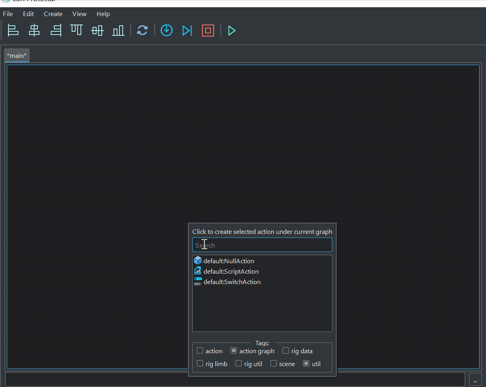
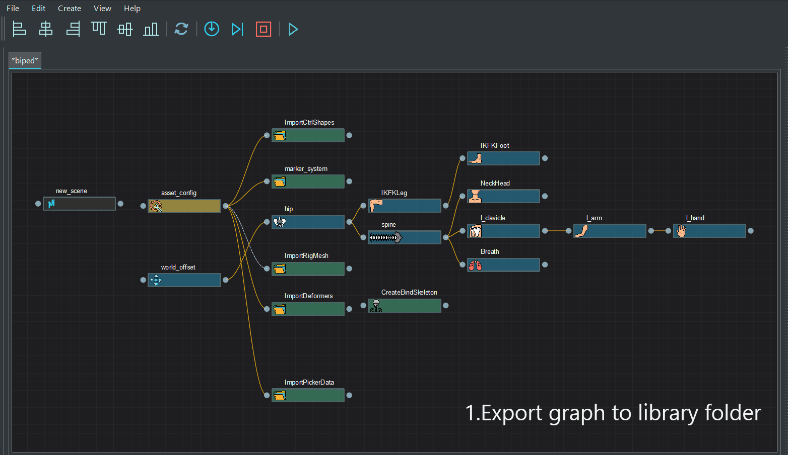

## Graph data I/O
User can serialize graph data with ui information to local disk through actions
 in file menu. In this way, graph node layout can be maintained or shared.

## Template/Reference
Protostar supports referencing graph file as template. To do it through ui is
simple:
1. Export graph to library graphs folder.  
2. Refresh library. 
3. Create graph from library dialog

